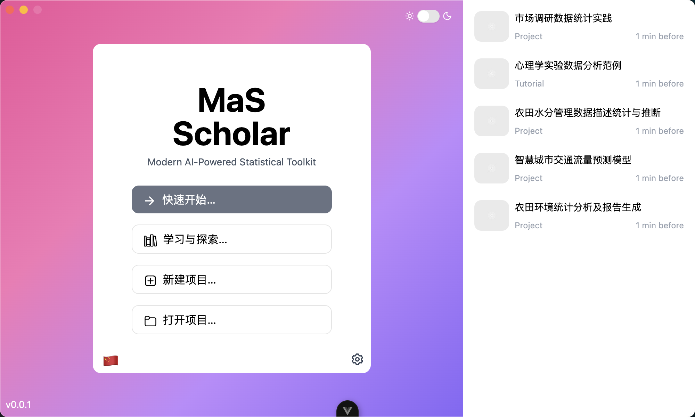

# MasScholar

> Abandoning a project halfway wastes years of research and reflection.
> Modeling and simulation are neither plug-and-play example libraries nor merely advanced coding.
> We should maintain respect for the engineering nature of computational methods.
> — 2025.08.01

MasScholar is a research workflow platform that makes the process of statistical analysis explicit, collaborative, and teachable.

By combining a desktop-grade application experience with cloud collaboration, MasScholar aims to become a modern, interactive alternative to SPSS® and SAS® in teaching and exploratory data analysis scenarios.



## Quick Start for Developers

```bash
pnpm i
pnpm dev:app
```

## Project Structure

```bash
├── apps/
  └── app                 # Client App
├── crates/
  └── ms-core             # Core Library
  └── ms-database         # Database Managment System eg. SQL, NoSQL, file-based DB, csv, json, etc.
  └── ms-simulation       # Simulation
  └── ms-statistics       # Statistics
  └── ms-operator         # Operator
├── packages/
  └── ms-chart            # Chart
  └── ms-editor           # Editor
  └── ms-i18n             # Internationalization
  └── ms-ui               # Ui Component for Electron App / Web App
├── vender/
  └── something third party
├── package.json
├── pnpm-workspace.yaml
├── README.md
├── turbo.json
```

## Algorithm Modules

| Category Submodules             | Functional Focus (Common User Questions)                                                                                 |
| ------------------------------- | ------------------------------------------------------------------------------------------------------------------------ |
| Descriptive Statistics          | [ ] Data cleaning, [ ] Frequency, [ ] Mean, [ ] Median, [ ] Standard deviation                                           |
| Inferential Statistics          | [ ] Hypothesis testing, [ ] t-test, [ ] Chi-square test, [ ] ANOVA, [ ] Confidence intervals                             |
| Regression Analysis             | [ ] Linear regression, [ ] Logistic regression, [ ] Multiple regression, [ ] Stepwise regression, [ ] Residual analysis  |
| ANOVA Models                    | [ ] One-way / Multi-factor ANOVA, [ ] Repeated measures, [ ] Mixed designs                                               |
| Nonparametric Methods           | [ ] Rank-sum tests, [ ] Mann–Whitney U, [ ] Wilcoxon test                                                                |
| Multiple Comparisons            | [ ] Bonferroni, [ ] Tukey HSD, [ ] Scheffé                                                                               |
| Survival Analysis               | [ ] Kaplan–Meier, [ ] Cox regression, [ ] Log-rank test                                                                  |
| Multivariate Analysis           | [ ] PCA, [ ] Factor analysis, [ ] Discriminant analysis, [ ] Cluster analysis                                            |
| Bayesian Analysis               | [ ] Bayesian regression, [ ] Bayesian updating, [ ] Bayes factor testing                                                 |
| Model Construction / Simulation | [ ] Custom models, [ ] Least squares, [ ] Multilevel linear models, [ ] Mixed-effects models, [ ] Monte Carlo simulation |

## Comparisons

<a href="https://star-history.com/#MasScholar/MasScholar&liquibase/liquibase&flyway/flyway&dbeaver/cloudbeaver&Date">
  
</a>
    
## Disclaimer

This project is released under the AGPL-3.0 license.

- SAS® is a registered trademark of The SAS Institute Inc.

- SPSS® is a registered trademark of IBM Corp.

- MATLAB® is a registered trademark of The MathWorks, Inc.

- R® is a registered trademark of the R Core Team.

- Python® is a registered trademark of the Python Software Foundation.
